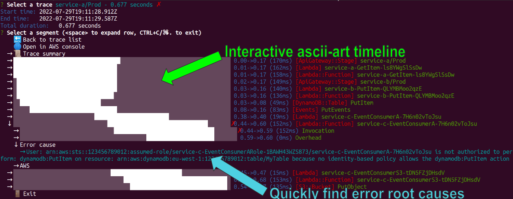
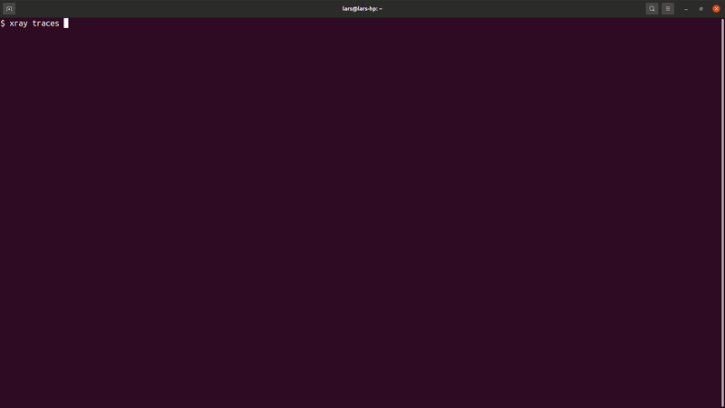

# xray-cli

Command line tool for quickly analysing AWS X-Ray traces. Get a quick overview of you applications traces to learn about bottlenecks and failure points.



## Installation
`npm install -g @mhlabs/xray-cli`

## Usage:

### Command: `traces`

```
$ xray traces --help
Usage: xray traces|t [options]

Find and render trace timeline. All parameters are optional.

Options:
  -s, --start <start>               Start time (minutes ago) (default: 5)
  -e, --end <end>                   End time (minutes ago) (default: 0)
  -as, --absolute-start <start>     Start time (ISO 8601)
  -ae, --absolute-end <end>         End time (ISO 8601)
  -f, --filter-expression <filter>  Filter expression. Must be inside double or single quotes ("/')
  -p, --profile <profile>           AWS profile to use (default: "default")
  -h, --help                        display help for command
```

#### Find a trace
Run `$ xray traces` to get a sample of the last 5 minutes of traces. Use `--start`, `--end`, `absolute-start` or `--absolute-end` if you know when the execution happened. The smaller time range, the faster retrieval.

#### Using filter expressions
This will find all traces with the occurrence of an exception containing the string 'not authorized'. Useful to find misconfigured IAM policies.
`xray traces --start 60 -f 'rootcause.error.exception { message CONTAINS "not authorized" }'

Refer to [AWS X-Ray documentation](https://docs.aws.amazon.com/xray/latest/devguide/xray-console-filters.html) for more information

